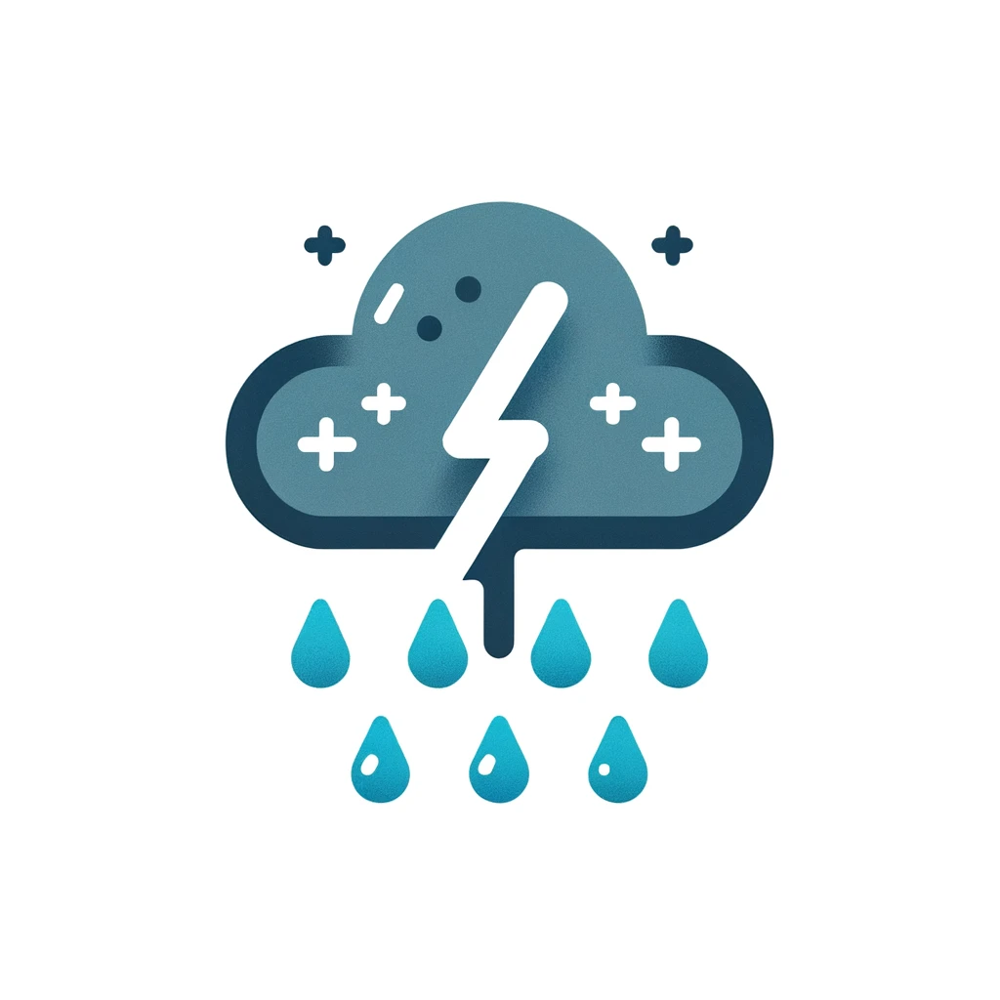
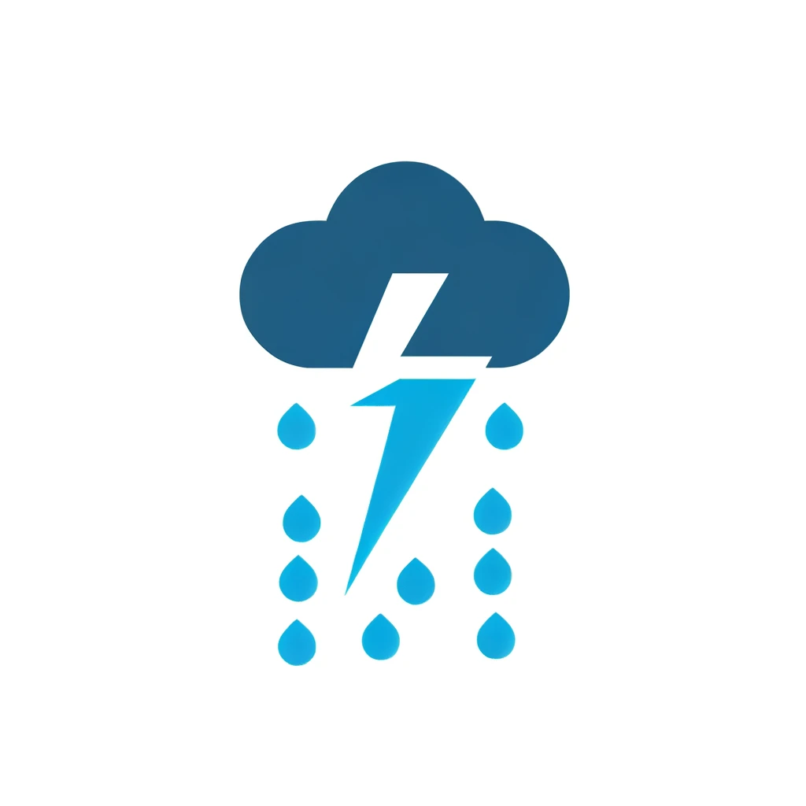

# Weather Conditions Icons ☁️
***The Weather Conditions Icons npm package is a comprehensive collection of weather icons designed to enhance the visual representation of different weather conditions. This package simplifies the integration of weather icons into your web applications, providing a wide range of symbols that accurately depict various weather phenomena.***

## Instillations
    npm install weather-conditions-icons
## Usage
#### **HTML or JavaScript projects.**
With the Weather Conditions Icons package, you can easily integrate weather icons into your HTML or JavaScript projects. Here's a basic example using core JavaScript:
    const weatherIcons = require('weather-conditions-icons');

    // Test for getting the default icon
    const defaultIcon = weatherIcons.getDefaultIcon();
    console.log('Default Icon:', defaultIcon);

    // Get the default icon
    const defaultIcon = weatherIcons.getDefaultIcon();
    console.log('Default Icon:', defaultIcon);

    // Get an icon by name
    const iconByName = weatherIcons.getIconByName('set-1', 'Thunderstorm with light rain');
    console.log('Icon by Name:', iconByName);

    // Get an icon by command
    const iconByCommand = weatherIcons.getIconByCommand('set-2', 'thunderstorm_with_light_rain');
    console.log('Icon by Command:', iconByCommand);

#### **In React**
    import React from 'react';
    import weatherIcons from 'weather-conditions-icons';

    const WeatherComponent = ({ condition }) => {
        // Get the default icon
        const defaultIcon = weatherIcons.getDefaultIcon();

        // Get an icon by name
        const iconByName = weatherIcons.getIconByName('set-1', 'Thunderstorm with light rain');

        // Get an icon by command
        const iconByCommand = weatherIcons.getIconByCommand('set-2', 'thunderstorm_with_light_rain');

        return (
            

                
                
                
            

        );
    };

    export default WeatherComponent;

#### **In Vue**
    <template>
    

        <!-- Get the default icon -->
        

        <!-- Get an icon by name -->
        

        <!-- Get an icon by command -->
        
    

    </template>

    

#### **In Angular**
    // app.component.ts
    import { Component } from '@angular/core';
    import weatherIcons from 'your-package-name';

    @Component({
    selector: 'app-root',
    template: `
        

        <!-- Get the default icon -->
        

        <!-- Get an icon by name -->
        

        <!-- Get an icon by command -->
        
        

    `,
    })
    export class AppComponent {
        weatherIcons = weatherIcons;
    }

## Icons 😊
### 1. Thunderstorm
	1. thunderstorm with light rain
	2. thunderstorm with rain
	3. thunderstorm with heavy rain
	4. light thunderstorm
	5. thunderstorm
	6. heavy thunderstorm
	7. ragged thunderstorm
	8. thunderstorm with light drizzle
	9. thunderstorm with drizzle
	10. thunderstorm with heavy drizzle

#### SET-1 (Thunderstorm).
-----------------------------------------------------------------------

| Sno | Name                        | Command                        | Icon                                                        |
|-----|-----------------------------|--------------------------------|-------------------------------------------------------------|
| 1   | Thunderstorm with light rain| thunderstorm_with_light_rain    |     |
| 2   | Thunderstorm with rain      | thunderstorm_with_rain          |           |
| 3   | Thunderstorm with heavy rain | thunderstorm_with_heavy_rain     |      |
| 4   | Light thunderstorm          | light_thunderstorm              |               |
| 5   | Thunderstorm                | thunderstorm                    |                     |
| 6   | Heavy thunderstorm          | heavy_thunderstorm              |               |
| 7   | Ragged thunderstorm         | ragged_thunderstorm             |              |
| 8   | Thunderstorm with light drizzle | thunderstorm_with_light_drizzle |  |
| 9   | Thunderstorm with drizzle   | thunderstorm_with_drizzle       |        |
| 10  | Thunderstorm with heavy drizzle | thunderstorm_with_heavy_drizzle |  |

### 2. Drizzle
    1. light intensity drizzle
    2. drizzle
    3. heavy intensity drizzle
    4. light intensity drizzle rain
    5. drizzle rain
    6. heavy intensity drizzle rain
    7. shower rain and drizzle
    8. heavy shower rain and drizzle
    9. shower drizzle

#### SET-1 (Drizzle).
-----------------------------------------------------------------------

| Sno | Name                         | Command                         | Icon                                                        |
|-----|------------------------------|---------------------------------|-------------------------------------------------------------|
| 1   | Light intensity drizzle      | light_intensity_drizzle         |  |
| 2   | Drizzle                      | drizzle                         |                |
| 3   | Heavy intensity drizzle      | heavy_intensity_drizzle         |  |
| 4   | Light intensity drizzle rain | light_intensity_drizzle_rain    |  |
| 5   | Drizzle rain                 | drizzle_rain                    |           |
| 6   | Heavy intensity drizzle rain | heavy_intensity_drizzle_rain    |  |
| 7   | Shower rain and drizzle      | shower_rain_and_drizzle         |  |
| 8   | Heavy shower rain and drizzle | heavy_shower_rain_and_drizzle    |  |
| 9   | Shower drizzle               | shower_drizzle                  |         |

### 3. Rain
    1. light rain
    2. moderate rain
    3. heavy intensity rain
    4. very heavy rain
    5. extreme rain
    6. freezing rain
    7. light intensity shower rain
    8. shower rain
    9. heavy intensity shower rain
    10. ragged shower rain
#### SET-1 (Rain).
-----------------------------------------------------------------------

| Sno | Name                        | Command                        | Icon                                                        |
|-----|-----------------------------|--------------------------------|-------------------------------------------------------------|
| 1   | Light rain                  | light_rain                      |            |
| 2   | Moderate rain               | moderate_rain                   |         |
| 3   | Heavy intensity rain        | heavy_intensity_rain            |  |
| 4   | Very heavy rain             | very_heavy_rain                 |       |
| 5   | Extreme rain                | extreme_rain                    |          |
| 6   | Freezing rain               | freezing_rain                   |         |
| 7   | Light intensity shower rain | light_intensity_shower_rain      |  |
| 8   | Shower rain                 | shower_rain                     |           |
| 9   | Heavy intensity shower rain | heavy_intensity_shower_rain      |  |
| 10  | Ragged shower rain          | ragged_shower_rain               |    |

### 4. Snow
    1. light snow
    2. snow
    3. heavy snow
    4. sleet
    5. light shower sleet
    6. shower sleet
    7. light rain and snow
    8. rain and snow
    9. light shower snow
    10. shower snow
    11. heavy shower snow
#### SET-1 (Snow).
-----------------------------------------------------------------------

| Sno | Name                   | Command                 | Icon                                                      |
|-----|------------------------|-------------------------|-----------------------------------------------------------|
| 1   | Light snow             | light_snow              |          |
| 2   | Snow                   | snow                    |                |
| 3   | Heavy snow             | heavy_snow              |          |
| 4   | Sleet                  | sleet                   |               |
| 5   | Light shower sleet     | light_shower_sleet      |  |
| 6   | Shower sleet           | shower_sleet            |        |
| 7   | Light rain and snow    | light_rain_and_snow     | |
| 8   | Rain and snow          | rain_and_snow           |       |
| 9   | Light shower snow      | light_shower_snow       |   |
| 10  | Shower snow            | shower_snow             |         |
| 11  | Heavy shower snow      | heavy_shower_snow       |   |

### 5. Atmosphere
    1. mist
    2. smoke
    3. haze
    4. sand_dust whirls
    5. fog
    6. sand
    7. dust
    8. volcanic ash
    9. squalls
    10. tornado
#### SET-1 (Atmosphere).
-----------------------------------------------------------------------

| Sno | Name                 | Command             | Icon                                              |
|-----|----------------------|---------------------|---------------------------------------------------|
| 1   | Mist                 | mist                |        |
| 2   | Smoke                | smoke               |       |
| 3   | Haze                 | haze                |        |
| 4   | Sand/dust whirls     | sand_dust_whirls    |  |
| 5   | Fog                  | fog                 |         |
| 6   | Sand                 | sand                |        |
| 7   | Dust                 | dust                |        |
| 8   | Volcanic ash         | volcanic_ash        |  |
| 9   | Squalls              | squalls             |     |
| 10  | Tornado              | tornado             |     |

### 6. Clear
    1. clear sky
#### SET-1 (Clear).
-----------------------------------------------------------------------

| Sno | Name         | Command  | Icon                                          |
|-----|--------------|----------|-----------------------------------------------|
| 1   | Clear sky    | clear_sky |  |

### 7. Clouds
    1. few clouds: 11-25%
    2. scattered clouds: 25-50%
    3. broken clouds: 51-84%
    4. overcast clouds: 85-100%
#### SET-1 (Clouds).
-----------------------------------------------------------------------

| Sno | Name                        | Command            | Icon                                                |
|-----|-----------------------------|--------------------|-----------------------------------------------------|
| 1   | Few clouds: 11-25%          | few_clouds         |    |
| 2   | Scattered clouds: 25-50%    | scattered_clouds   |  |
| 3   | Broken clouds: 51-84%       | broken_clouds      |  |
| 4   | Overcast clouds: 85-100%    | overcast_clouds    |  |

